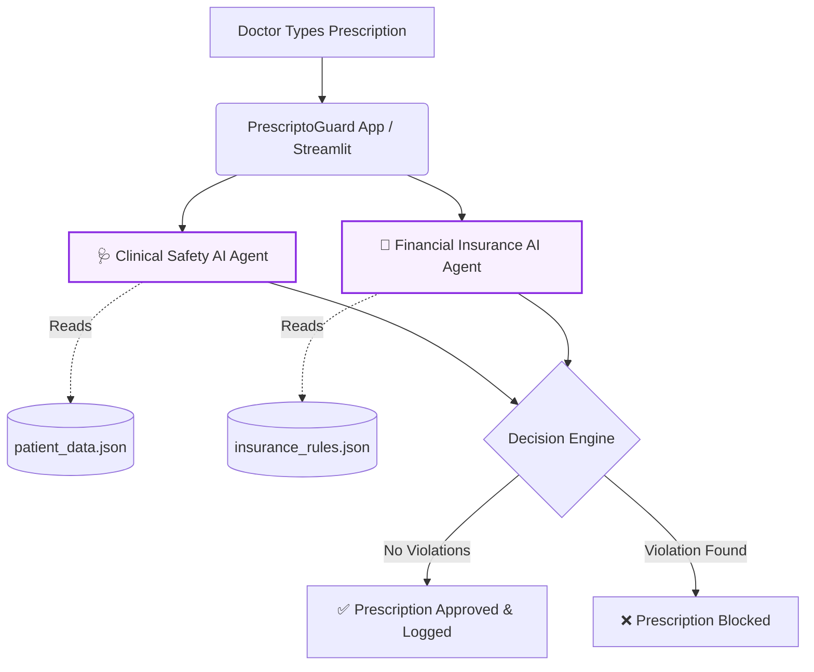

# 🏥 PrescriptoGuard AI 
**Autonomous Medical & Financial Safety Net**
*(Built for Hackathon Problem Statement 5: Domain-Specialized AI Agents)*

## 🚀 The Problem
Mid-sized hospitals face a massive 15% insurance claim rejection rate because doctors cannot memorize thousands of complex insurance policies. Worse, prescribing the wrong drug can cause lethal clinical interactions. 

## 💡 Our Solution
An autonomous, multi-agent AI safety net that intercepts prescriptions *before* they are saved. We utilized Groq's lightning-fast Llama-3 model to create a multi-agent workflow:
1. **Clinical Safety Agent:** Checks the patient's EHR for allergies and chronic condition conflicts.
2. **Financial Compliance Agent:** Cross-checks the prescription against the patient's specific insurance policy guardrails (e.g., Step-therapy, generic vs. branded).

## 💰 Business Impact
By catching violations at the point of prescription, we reduce claim rejections to 2%, recovering over **₹2.6 Crore in trapped cash flow per month** for an average hospital.
   ## 🏗️ System Architecture

## 🛠️ How to run locally
1. Clone this repository.
2. Install dependencies: `pip install streamlit groq`
3. Add your Groq API key in `app.py`.
4. Run the app: `streamlit run app.py`

